# 	 一、SpringCloud入门

## 1. 分布式、集群、微服务、SOA 之间的区别

分布式：不同模块部署在不同服务器上
作用：分布式解决网站高并发带来问题

集群：多台服务器部署相同应用构成一个集群
作用：通过负载均衡设备共同对外提供服务

SOA：业务系统分解为多个组件，让每个组件都独立提供离散，自治，可复用的服务能力，通过服务的组合和编排来实现上层的业务流程
作用：简化维护,降低整体风险,伸缩灵活

微服务：架构设计概念,各服务间隔离（分布式也是隔离）,自治（分布式依赖整体组合）其它特性(单一职责,边界,异步通信,独立部署)是分布式概念的跟严格执行SOA到微服务架构的演进过程
作用：各服务可独立应用，组合服务也可系统应用

## 2.分布式和微服务的区别

微服务是架构设计方式，分布式是系统部署方式，两者概念不同

微服务是指很小的服务，可以小到只完成一个功能，这个服务可以单独部署运行，不同服务之间通过rpc调用。

分布式是指服务部署在不同的机器上，一个服务可以提供一个或多个功能，服务之间也是通过rpc来交互或者是webservice来交互的。

两者的关系是，系统应用部署在超过一台服务器或虚拟机上，且各分开部署的部分彼此通过各种通讯协议交互信息，就可算作分布式部署，生产环境下的微服务肯定是分布式部署的，分布式部署的应用不一定是微服务架构的，比如集群部署，它是把相同应用复制到不同服务器上，但是逻辑功能上还是单体应用。

## 3.微服务介绍


## 4.微服务组件停更和使用说明


## 5.分布式的CAP原则

``` markdown
	CAP原则又称CAP定理，指的是在一个分布式系统中，一致性（Consistency）、可用性（Availability）、分区容错性（Partition tolerance）。CAP 原则指的是，这三个要素最多只能同时实现两点，不可能三者兼顾。
# 1.分区容错性
	指的分布式系统中的某个节点或者网络分区出现了故障的时候，整个系统仍然能对外提供满足一致性和可用性的服务。也就是说部分故障不影响整体使用。事实上我们在设计分布式系统是都会考虑到bug,硬件，网络等各种原因造成的故障，所以即使部分节点或者网络出现故障，我们要求整个系统还是要继续使用的(不继续使用,相当于只有一个分区,那么也就没有后续的一致性和可用性了)
# 2.可用性
	一直可以正常的做读写操作。简单而言就是客户端一直可以正常访问并得到系统的正常响应。用户角度来看就是不会出现系统操作失败或者访问超时等问题。
# 3.一致性
	在分布式系统完成某写操作后任何读操作，都应该获取到该写操作写入的那个最新的值。相当于要求分布式系统中的各节点时时刻刻保持数据的一致性。
	
(1) CA: 优先保证一致性和可用性，放弃分区容错。 这也意味着放弃系统的扩展性，系统不再是分布式的，有违设计的初衷。
(2) CP: 优先保证一致性和分区容错性，放弃可用性。在数据一致性要求比较高的场合(譬如:zookeeper,Hbase) 是比较常见的做法，一旦发生网络故障或者消息丢失，就会牺牲用户体验，等恢复之后用户才逐渐能访问。
(3) AP: 优先保证可用性和分区容错性，放弃一致性。NoSQL中的Cassandra 就是这种架构。跟CP一样，放弃一致性不是说一致性就不保证了，而是逐渐的变得一致。
```


``` markdown
# 1.什么是分布式系统
	拿一个最简单的例子，就比如说我们的图书管理系统。之前的系统包含了所有的功能，比如用户注册登录、管理员功能、图书借阅管理等。这叫做集中式系统。也就是一个人干了好几件事。
	后来随着功能的增多，用户量也越来越大。集中式系统维护太麻烦，拓展性也不好。于是就考虑着把这些功能分开。通俗的理解就是原本需要一个人干的事，现在分给n个人干，各自干各自的，最终取得和一个人干的效果一样。
	稍微正规一点的定义就是：一个业务分拆多个子业务，部署在不同的服务器上。 然后通过一定的通信协议，能够让这些子业务之间相互通信。
	既然分给了n个人，那就涉及到这些人的沟通交流协作问题。想要去解决这些问题，就需要先聊聊分布式系统中的CAP理论。千万不要被这个看起来高大上的概念迷惑住。
```

## 6.分布式和集群的区别


``` markdown
# 1.单机结构
	我想大家最最最熟悉的就是单机结构，一个系统业务量很小的时候所有的代码都放在一个项目中就好了，然后这个项目部署在一台服务器上就好了。整个项目所有的服务都由这台服务器提供。这就是单机结构。那么，单机结构有啥缺点呢？我想缺点是显而易见的，单机的处理能力毕竟是有限的，当你的业务增长到一定程度的时候，单机的硬件资源将无法满足你的业务需求。此时便出现了集群模式，往下接着看。
# 2.集群结构
	集群模式在程序猿界有各种装逼解释，有的让你根本无法理解，其实就是一个很简单的玩意儿，且听我一一道来。单机处理到达瓶颈的时候，你就把单机复制几份，这样就构成了一个“集群”。集群中每台服务器就叫做这个集群的一个“节点”，所有节点构成了一个集群。每个节点都提供相同的服务，那么这样系统的处理能力就相当于提升了好几倍（有几个节点就相当于提升了这么多倍）。但问题是用户的请求究竟由哪个节点来处理呢？最好能够让此时此刻负载较小的节点来处理，这样使得每个节点的压力都比较平均。要实现这个功能，就需要在所有节点之前增加一个“调度者”的角色，用户的所有请求都先交给它，然后它根据当前所有节点的负载情况，决定将这个请求交给哪个节点处理。这个“调度者”有个牛逼了名字——负载均衡服务器。集群结构的好处就是系统扩展非常容易。如果随着你们系统业务的发展，当前的系统又支撑不住了，那么给这个集群再增加节点就行了。但是，当你的业务发展到一定程度的时候，你会发现一个问题——无论怎么增加节点，貌似整个集群性能的提升效果并不明显了。这时候，你就需要使用微服务结构了。
# 3.分布式结构
	先来对前面的知识点做个总结。从单机结构到集群结构，你的代码基本无需要作任何修改，你要做的仅仅是多部署几台服务器，每台服务器上运行相同的代码就行了。但是，当你要从集群结构演进到微服务结构的时候，之前的那套代码就需要发生较大的改动了。所以对于新系统我们建议，系统设计之初就采用微服务架构，这样后期运维的成本更低。但如果一套老系统需要升级成微服务结构的话，那就得对代码大动干戈了。
	所以，对于老系统而言，究竟是继续保持集群模式，还是升级成微服务架构，这需要你们的架构师深思熟虑、权衡投入产出比。OK，下面开始介绍所谓的分布式结构。分布式结构就是将一个完整的系统，按照业务功能，拆分成一个个独立的子系统，在分布式结构中，每个子系统就被称为“服务”。这些子系统能够独立运行在web容器中，它们之间通过RPC方式通信。举个例子，假设需要开发一个在线商城。
	按照微服务的思想，我们需要按照功能模块拆分成多个独立的服务，如：用户服务、产品服务、订单服务、后台管理服务、数据分析服务等等。这一个个服务都是一个个独立的项目，可以独立运行。
	如果服务之间有依赖关系，那么通过RPC方式调用。这样的好处有很多：系统之间的耦合度大大降低，可以独立开发、独立部署、独立测试，系统与系统之间的边界非常明确，排错也变得相当容易，开发效率大大提升。系统之间的耦合度降低，从而系统更易于扩展。我们可以针对性地扩展某些服务。假设这个商城要搞一次大促，下单量可能会大大提升，因此我们可以针对性地提升订单系统、产品系统的节点数量，而对于后台管理系统、数据分析系统而言，节点数量维持原有水平即可。服务的复用性更高。比如，当我们将用户系统作为单独的服务后，该公司所有的产品都可以使用该系统作为用户系统，无需重复开发。
```


# 二、SpringCloud 父工程创建

## 1. 父工程创建


## 2.父工程Pom文件

``` markdown
# dependencyManagement
	声明依赖，但是不会引用，为了方便管理
	通常会在一个组织或者项目的最顶层的POM文件中看到
	使用Pom.xml中的dependencyManagement元素能让所有在子项目中引用一个依赖而不用显示的列出版本号。Maven会到父层次找，找到一个项目写了dependencyMangement的，会使用这里面指定的版本号
	父类使用了，子类就可以直接写引用的东西，不用写版本号，这样使得版本统一
```

```XML
<?xml version="1.0" encoding="UTF-8"?>

<project xmlns="http://maven.apache.org/POM/4.0.0" xmlns:xsi="http://www.w3.org/2001/XMLSchema-instance"
  xsi:schemaLocation="http://maven.apache.org/POM/4.0.0 http://maven.apache.org/xsd/maven-4.0.0.xsd">
  <modelVersion>4.0.0</modelVersion>

  <groupId>com.atguigu.springcloud</groupId>
  <artifactId>cloud2020</artifactId>
  <packaging>pom</packaging>
  <version>1.0-SNAPSHOT</version>
  <modules>
    <module>cloud-provider-payment8001</module>
  </modules>

  <name>Maven</name>
  <!-- FIXME change it to the project's website -->
  <url>http://maven.apache.org/</url>
  <inceptionYear>2001</inceptionYear>

  <distributionManagement>
    <site>
      <id>website</id>
      <url>scp://webhost.company.com/www/website</url>
    </site>
  </distributionManagement>


  <!-- 缁熶竴绠＄悊jar鍖呯増鏈?-->
  <properties>
    <project.build.sourceEncoding>UTF-8</project.build.sourceEncoding>
    <maven.compiler.source>1.8</maven.compiler.source>
    <maven.compiler.target>1.8</maven.compiler.target>
    <junit.version>4.12</junit.version>
    <log4j.version>1.2.17</log4j.version>
    <lombok.version>1.16.18</lombok.version>
    <mysql.version>5.1.47</mysql.version>
    <druid.version>1.1.16</druid.version>
    <mybatis.spring.boot.version>1.3.0</mybatis.spring.boot.version>
  </properties>

  <dependencyManagement>
    <dependencies>
      <dependency>
        <groupId>org.springframework.boot</groupId>
        <artifactId>spring-boot-dependencies</artifactId>
        <version>2.2.2.RELEASE</version>
        <type>pom</type>
        <scope>import</scope>
      </dependency>
      <dependency>
        <groupId>org.springframework.cloud</groupId>
        <artifactId>spring-cloud-dependencies</artifactId>
        <version>Hoxton.SR1</version>
        <type>pom</type>
        <scope>import</scope>
      </dependency>
      <dependency>
        <groupId>com.alibaba.cloud</groupId>
        <artifactId>spring-cloud-alibaba-dependencies</artifactId>
        <version>2.1.0.RELEASE</version>
        <type>pom</type>
        <scope>import</scope>
      </dependency>
      <dependency>
        <groupId>mysql</groupId>
        <artifactId>mysql-connector-java</artifactId>
        <version>${mysql.version}</version>
      </dependency>
      <dependency>
        <groupId>com.alibaba</groupId>
        <artifactId>druid</artifactId>
        <version>${druid.version}</version>
      </dependency>
      <dependency>
        <groupId>org.mybatis.spring.boot</groupId>
        <artifactId>mybatis-spring-boot-starter</artifactId>
        <version>${mybatis.spring.boot.version}</version>
      </dependency>
      <dependency>
        <groupId>junit</groupId>
        <artifactId>junit</artifactId>
        <version>${junit.version}</version>
      </dependency>
      <dependency>
        <groupId>log4j</groupId>
        <artifactId>log4j</artifactId>
        <version>${log4j.version}</version>
      </dependency>
      <dependency>
        <groupId>org.projectlombok</groupId>
        <artifactId>lombok</artifactId>
        <version>${lombok.version}</version>
        <optional>true</optional>
      </dependency>
    </dependencies>
  </dependencyManagement>

  <build>
    <plugins>
      <plugin>
        <groupId>org.springframework.boot</groupId>
        <artifactId>spring-boot-maven-plugin</artifactId>
        <configuration>
          <fork>true</fork>
          <addResources>true</addResources>
        </configuration>
      </plugin>
    </plugins>
  </build>

</project>
```

父项目	子项目		

# 三、SpringClouod支付模块创建

## 1.建module


## 2.改POM

```xml
<dependencies>
    <!--包含了sleuth+zipkin-->
    <dependency>
        <groupId>org.springframework.cloud</groupId>
        <artifactId>spring-cloud-starter-zipkin</artifactId>
    </dependency>
    <!--eureka-client-->
    <dependency>
        <groupId>org.springframework.cloud</groupId>
        <artifactId>spring-cloud-starter-netflix-eureka-client</artifactId>
    </dependency>
    <dependency><!-- 引入自己定义的api通用包，可以使用Payment支付Entity -->
        <groupId>com.atguigu.springcloud</groupId>
        <artifactId>cloud-api-commons</artifactId>
        <version>${project.version}</version>
    </dependency>
    <dependency>
        <groupId>org.springframework.boot</groupId>
        <artifactId>spring-boot-starter-web</artifactId>
    </dependency>
    <dependency>
        <groupId>org.springframework.boot</groupId>
        <artifactId>spring-boot-starter-actuator</artifactId>
    </dependency>
    <dependency>
        <groupId>org.mybatis.spring.boot</groupId>
        <artifactId>mybatis-spring-boot-starter</artifactId>
    </dependency>
    <dependency>
        <groupId>com.alibaba</groupId>
        <artifactId>druid-spring-boot-starter</artifactId>
        <version>1.1.10</version>
    </dependency>
    <!--mysql-connector-java-->
    <dependency>
        <groupId>mysql</groupId>
        <artifactId>mysql-connector-java</artifactId>
    </dependency>
    <!--jdbc-->
    <dependency>
        <groupId>org.springframework.boot</groupId>
        <artifactId>spring-boot-starter-jdbc</artifactId>
    </dependency>
    <dependency>
        <groupId>org.springframework.boot</groupId>
        <artifactId>spring-boot-devtools</artifactId>
        <scope>runtime</scope>
        <optional>true</optional>
    </dependency>
    <dependency>
        <groupId>org.projectlombok</groupId>
        <artifactId>lombok</artifactId>
        <optional>true</optional>
    </dependency>
    <dependency>
        <groupId>org.springframework.boot</groupId>
        <artifactId>spring-boot-starter-test</artifactId>
        <scope>test</scope>
    </dependency>
</dependencies>
```

## 3.写YML

```yml
server:
  port: 8001

spring:
  application:
    name: cloud-provider-payment-service
  datasource:
    type: com.alibaba.druid.pool.DruidDataSource
    driver-class-name: org.gjt.mm.mysql.Driver
    url: jdbc:mysql://localhost:3306/db2019?useUnicode=true&characterEncoding=utf-8&useSSL=fase
    data-username: root
    data-password: 123456

mybatis:
  mapper-locations: classpath:mapper/*.xml
  type-aliases-package: com.atguigu.springcloud.entities
```

## 4.主启动


# 四、热部署 devtools的配置

```xml
<dependency>
    <groupId>org.springframework.boot</groupId>
    <artifactId>spring-boot-devtools</artifactId>
    <scope>runtime</scope>
    <optional>true</optional>
</dependency>
```


``` java
crtl+shift+alt+/ 然后选registry
```


# 五、Eureka

## 1.1什么是Eureka

```markdown
	又称服务中心，管理各种服务功能包括服务的注册、发现、熔断、负载、降级等。
	
	任何一个服务都不能直接去掉用，都需要通过注册中心来调用。通过服务中心来获取服务你不需要关注你调用的项目IP地址，由几台服务器组成，每次直接去服务中心获取可以使用的服务去调用既可。
	由于各种服务都注册到了服务中心，就有了很多高级功能条件。比如几台服务提供相同服务来做客户端负载均衡（Ribbon）；监控服务器调用成功率来做断路器（Hystrix），移除服务列表中的故障点；监控服务调用时间来对不同的服务器设置不同的权重、智能路有（Zuul）等等。

	Spring Cloud 封装了 Netflix 公司开发的 Eureka 模块来实现服务注册和发现。Eureka 采用了 C-S 的设计架构。Eureka Server 作为服务注册功能的服务器，它是服务注册中心。而系统中的其他微服务，使用 Eureka 的客户端连接到 Eureka Server，并维持心跳连接。这样系统的维护人员就可以通过 Eureka Server 来监控系统中各个微服务是否正常运行。Spring Cloud 的一些其他模块（比如Zuul）就可以通过 Eureka Server 来发现系统中的其他微服务，并执行相关的逻辑。

	Eureka由两个组件组成：Eureka服务器和Eureka客户端。Eureka服务器用作服务注册服务器。Eureka客户端是一个java客户端，用来简化与服务器的交互、作为轮询负载均衡器，并提供服务的故障切换支持。Netflix在其生产环境中使用的是另外的客户端，它提供基于流量、资源利用率以及出错状态的加权负载均衡。
```

```markdown
# 1.Eureka Server：注册中心服务端
    1.服务注册
    服务提供者启动时，会通过 Eureka Client 向 Eureka Server 注册信息，Eureka Server 会存储该服务的信息，Eureka Server 内部有二层缓存机制来维护整个注册表
    2.提供注册表
    服务消费者在调用服务时，如果 Eureka Client 没有缓存注册表的话，会从 Eureka Server 获取最新的注册表
    3.同步状态
    Eureka Client 通过注册、心跳机制和 Eureka Server 同步当前客户端的状态。
# 2.Eureka Client：注册中心客户端
	Eureka Client 是一个 Java 客户端，用于简化与 Eureka Server 的交互。Eureka Client 会拉取、更新和缓存 Eureka Server 中的信息。因此当所有的 Eureka Server 节点都宕掉，服务消费者依然可以使用缓存中的信息找到服务提供者，但是当服务有更改的时候会出现信息不一致。
# 3.Register: 服务注册
    服务的提供者，将自身注册到注册中心，服务提供者也是一个 Eureka Client。当 Eureka Client 向 Eureka Server 注册时，它提供自身的元数据，比如 IP 地址、端口，运行状况指示符 URL，主页等。
# 4.Renew: 服务续约
	Eureka Client 会每隔 30 秒发送一次心跳来续约。 通过续约来告知 Eureka Server 该 Eureka Client 运行正常，没有出现问题。 默认情况下，如果 Eureka Server 在 90 秒内没有收到 Eureka Client 的续约，Server 端会将实例从其注册表中删除，此时间可配置，一般情况不建议更改。
	服务续约任务的调用间隔时间，默认为30秒
    	eureka.instance.lease-renewal-interval-in-seconds=30
   	服务失效的时间，默认为90秒。
    	eureka.instance.lease-expiration-duration-in-seconds=90
 # 5.Eviction 服务剔除
 	当 Eureka Client 和 Eureka Server 不再有心跳时，Eureka Server 会将该服务实例从服务注册列表中删除，即服务剔除。
 # 6.Cancel: 服务下线
    Eureka Client 在程序关闭时向 Eureka Server 发送取消请求。 发送请求后，该客户端实例信息将从 Eureka Server 的实例注册表中删除。该下线请求不会自动完成，它需要调用以下内容：
    DiscoveryManager.getInstance().shutdownComponent()；
 # 7.GetRegisty: 获取注册列表信息
 	Eureka Client 从服务器获取注册表信息，并将其缓存在本地。客户端会使用该信息查找其他服务，从而进行远程调用。该注册列表信息定期（每30秒钟）更新一次。每次返回注册列表信息可能与 Eureka Client 的缓存信息不同，Eureka Client 自动处理。
 	如果由于某种原因导致注册列表信息不能及时匹配，Eureka Client 则会重新获取整个注册表信息。 Eureka Server 缓存注册列表信息，整个注册表以及每个应用程序的信息进行了压缩，压缩内容和没有压缩的内容完全相同。Eureka Client 和 Eureka Server 可以使用 JSON/XML 格式进行通讯。在默认情况下 Eureka Client 使用压缩 JSON 格式来获取注册列表的信息。
 	# 启用服务消费者从注册中心拉取服务列表的功能
    eureka.client.fetch-registry=true
    # 设置服务消费者从注册中心拉取服务列表的间隔
    eureka.client.registry-fetch-interval-seconds=30
# 8.Remote Call: 远程调用
    当 Eureka Client 从注册中心获取到服务提供者信息后，就可以通过 Http 请求调用对应的服务；服务提供者有多个时，Eureka Client 客户端会通过 Ribbon 自动进行负载均衡。
```


``` markdown
# 1、Eureka Server
	Eureka Server 作为一个独立的部署单元，以 REST API 的形式为服务实例提供了注册、管理和查询等操作。同时，Eureka Server 也为我们提供了可视化的监控页面，可以直观地看到各个 Eureka Server 当前的运行状态和所有已注册服务的情况。

# 2、Service Provider
	服务提供方
	将自身服务注册到Eureka，从而使服务消费方能够找到

# 3、Service Consumer
    服务消费方
    从Eureka获取注册服务列表，从而能够消费服务
```

## 1.2 Eureka配置

```xml
<dependency>
    <groupId>org.springframework.cloud</groupId>
    <artifactId>spring-cloud-starter-netflix-eureka-server</artifactId>
</dependency>
```

``` yml
server:
  port: 7001

eureka:
  instance:
    hostname: localhost #eureka服务端的实例名称
  client:
    #false表示不想注册中心注册自己
    register-with-eureka: false
    #false表示自己就是服务中心 我是维护服务实例，不需要去检索服务
    fetch-registry: false
    #设置eureka server交互的地址查询服务和注册服务都需要依赖这个地址
    service-url:
      defaultZone: http://${eureka.instance.hostname}:${server.port}/eureka/

```


> 说明启动成功

## 1.3 cloud-provider-paymeny-8001注册进eureka

```xml
<dependency>
    <groupId>org.springframework.cloud</groupId>
    <artifactId>spring-cloud-starter-netflix-eureka-client</artifactId>
</dependency>
```


```yml
server:
  port: 8001

spring:
  application:
    name: cloud-provider-payment-service
  datasource:
    type: com.alibaba.druid.pool.DruidDataSource
    driver-class-name: org.gjt.mm.mysql.Driver
    url: jdbc:mysql://localhost:3306/cloud2020?useUnicode=true&characterEncoding=utf-8&useSSL=false&serverTimezone=UTC
    username: root
    password: 123456
mybatis:
  mapper-locations: classpath:mapper/*.xml
  type-aliases-package: com.atguigu.springcloud.entities
eureka:
  client:
    register-with-eureka: true
    fetch-registry: true
    service-url:
      defaultZone: http://localhost:7001/eureka
```


## 1.4 cloud-consumer-order81注册进eureka

``` xml
<dependency>
    <groupId>org.springframework.cloud</groupId>
    <artifactId>spring-cloud-starter-netflix-eureka-client</artifactId>
</dependency>
```

```yml
server:
  port: 81
spring:
  application:
    name: colud-consumer-order-service
eureka:
  client:
    service-url:
      defaultZone: http://localhost:7001/eureka
    fetch-registry: true
    register-with-eureka: true
```


## 1.5 Eureka的自我保护机制

``` markdown
    默认情况下，如果 Eureka Server 在一定的 90s 内没有接收到某个微服务实例的心跳，会注销该实例。但是在微服务架构下服务之间通常都是跨进程调用，网络通信往往会面临各种问题，比如微服务状态正常，网络分区故障，导致此实例被注销。
    固定时间内大量实例被注销，可能会严重威胁整个微服务架构的可用性。为了解决这个问题，Eureka 开发了自我保护机制，那么什么是自我保护机制呢？
    Eureka Server 在运行期间会去统计心跳失败比例在 15 分钟之内是否低于 85%，如果低于 85%，Eureka Server 即会进入自我保护机制。
# Eureka Server 进入自我保护机制，会出现以下几种情况：
    (1 Eureka 不再从注册列表中移除因为长时间没收到心跳而应该过期的服务
    (2 Eureka 仍然能够接受新服务的注册和查询请求，但是不会被同步到其它节点上(即保证当前节点依然可用)
    (3 当网络稳定时，当前实例新的注册信息会被同步到其它节点中
    
    Eureka 自我保护机制是为了防止误杀服务而提供的一个机制。当个别客户端出现心跳失联时，则认为是客户端的问题，剔除掉客户端；当 Eureka 捕获到大量的心跳失败时，则认为可能是网络问题，进入自我保护机制；当客户端心跳恢复时，Eureka 会自动退出自我保护机制。
    如果在保护期内刚好这个服务提供者非正常下线了，此时服务消费者就会拿到一个无效的服务实例，即会调用失败。对于这个问题需要服务消费者端要有一些容错机制，如重试，断路器等。
```

**通过在 Eureka Server 配置如下参数，开启或者关闭保护机制，生产环境建议打开：**

``` yml
eureka.server.enable-self-preservation=true
```

``` markdown
	一句话:某时刻一个微服务不可用了，Rureka不会立刻清理，依旧会对该微服务的信息进行保存
```


## 1.6Eureka在项目中的作用


Eureka开启的话，服务掉线不会剔除

Eureka关闭的话，服务掉线会在检测时间过后会剔除

## 1.7Eureka集群

配置两台eureka对应的地址


配置7001配置文件

``` yml
server:
  port: 7001

eureka:
  instance:
    hostname: eureka7001.com #eureka服务端的实例名称
  client:
    #false表示不想注册中心注册自己
    register-with-eureka: false
    #false表示自己就是服务中心 我是维护服务实例，不需要去检索服务
    fetch-registry: false
    #设置eureka server交互的地址查询服务和注册服务都需要依赖这个地址
    service-url:
      defaultZone: http://eureka7002.com:7002/eureka/

```

7002配置文件

``` yml
server:
  port: 7002

eureka:
  instance:
    hostname: eureka7002.com  #eureka服务端的实例名称
  client:
    #false表示不想注册中心注册自己
    register-with-eureka: false
    #false表示自己就是服务中心 我是维护服务实例，不需要去检索服务
    fetch-registry: false
    #设置eureka server交互的地址查询服务和注册服务都需要依赖这个地址
    service-url:
      defaultZone: http://eureka7001.com:7001/eureka/

```


## 1.8将微服务注册进集群

只需要将URL地址改成如下

```yml
defaultZone: http://eureka7001.com:7001/eureka,http://eureka7002.com:7002/eureka
```


## 1.9支付模块升级，支付模块集群

``` markdown
# 将模块1复制，改端口号即可
```


实现负载均衡

``` markdown
# 地址要写服务名称
	public static final String PAYMENT_URL="http://CLOUD-PROVIDER-PAYMENT-SERVICE";
# RestTemplate要加一个负载均衡的注解
    @Bean
    @LoadBalanced
        public RestTemplate getRestTemplate(){
        return new RestTemplate();
    }
```

## 1.10Discovery


```Java
 @Autowired
private DiscoveryClient discoveryClient;

@GetMapping("/payment/discovery")
public Object discovery(){
    List<String> services = discoveryClient.getServices();
    for(String s:services){
        log.info("---"+s);
    }

    List<ServiceInstance> instances = discoveryClient.getInstances("CLOUD-PROVIDER-PAYMENT-SERVICE");
    for (ServiceInstance s :
            instances) {
        log.info(s.getServiceId()+"\t"+s.getHost()+"\t"+s.getPort()+"\t"+s.getUri());
    }
    return this.discoveryClient;
}

@SpringBootApplication
@EnableEurekaClient
@EnableDiscoveryClient
public class PaymentMain8002 {
    public static void main(String[] args) {
        SpringApplication.run(PaymentMain8002.class,args);
    }
}
```

## 1.11Eureka和Zookeeper的CAP应用

```markdown
# Zookeeper保证CP
	当向注册中心查询服务列表时，我们可以容忍注册中心返回的是几分钟以前的注册信息，但不能接受服务直接down掉不可用。也就是说，服务注册功能对可用性的要求要高于一致性。但是zk会出现这样一种情况，当master节点因为网络故障与其他节点失去联系时，剩余节点会重新进行leader选举。问题在于，选举leader的时间太长，30 ~ 120s, 且选举期间整个zk集群都是不可用的，这就导致在选举期间注册服务瘫痪。在云部署的环境下，因网络问题使得zk集群失去master节点是较大概率会发生的事，虽然服务能够最终恢复，但是漫长的选举时间导致的注册长期不可用是不能容忍的。
```

```markdown
zookeeper也可以作为注册中心，用于服务治理（zookeeper还有其他用途，例如：分布式事务锁等）   
每启动一个微服务，就会去zk中注册一个临时子节点，
例如：5台订单服务，4台商品服务
（5台订单服务在zk中的订单目录下创建的5个临时节点）
（4台商品服务在zk中的商品目录下创建的4个临时接点）

每当有一个服务down机，由于是临时接点，此节点会立即被删除，并通知订阅该服务的微服务更新服务列表
（zk上有watch，每当有节点更新，都会通知订阅该服务的微服务更新服务列表）

每当有一个新的微服务注册进来，就会在对应的目录下创建临时子节点，并通知订阅该服务的微服务更新服务列表
（zk上有watch，每当有节点更新，都会通知订阅该服务的微服务更新服务列表）

每个微服务30s向zk获取新的服务列表
```

``` markdown
# Eureka保证AP	
	Eureka看明白了这一点，因此在设计时就优先保证可用性。Eureka各个节点都是平等的，几个节点挂掉不会影响正常节点的工作，剩余的节点依然可以提供注册和查询服务。而Eureka的客户端在向某个Eureka注册或时如果发现连接失败，则会自动切换至其它节点，只要有一台Eureka还在，就能保证注册服务可用(保证可用性)，只不过查到的信息可能不是最新的(不保证强一致性)。除此之外，Eureka还有一种自我保护机制，如果在15分钟内超过85%的节点都没有正常的心跳，那么Eureka就认为客户端与注册中心出现了网络故障，此时会出现以下几种情况： 
1. Eureka不再从注册列表中移除因为长时间没收到心跳而应该过期的服务 
2. Eureka仍然能够接受新服务的注册和查询请求，但是不会被同步到其它节点上(即保证当前节点依然可用) 
3. 当网络稳定时，当前实例新的注册信息会被同步到其它节点中
	因此， Eureka可以很好的应对因网络故障导致部分节点失去联系的情况，而不会像zookeeper那样使整个注册服务瘫痪。
```

```markdown
每一个微服务中都有eureka client，用于服务的注册于发现 （服务的注册：把自己注册到eureka server） （服务的发现：从eureka server获取自己需要的服务列表） 每一个微服务启动的时候，都需要去eureka server注册 当A服务需要调用B服务时，需要从eureka服务端获取B服务的服务列表，然后把列表缓存到本地，然后根据ribbon的客户端负载均衡规则，从服务列表中取到一个B服务，然后去调用此B服务 当A服务下次再此调用B服务时，如果发现本地已经存储了B的服务列表，就不需要再从eureka服务端获取B服务列表，直接根据ribbon的客户端负载均衡规则，从服务列表中取到一个B服务，然后去调用B服务 微服务，默认每30秒，就会从eureka服务端获取一次最新的服务列表 如果某台微服务down机，或者添加了几台机器， 此时eureka server会通知订阅他的客户端，并让客户端更新服务列表， 而且还会通知其他eureka server更新此信息 心跳检测，微服务每30秒向eureka server发送心跳， eureka server若90s之内都没有收到某个客户端的心跳，则认为此服务出了问题， 会从注册的服务列表中将其删除，并通知订阅它的客户端更新服务列表， 而且还会通知其他eureka server更新此信息 eureka server保护机制，通过打卡开关，可以让eureka server处于保护状态，主要是用于某eureka server由于网络或其他原因，导致接收不到其他微服务的心跳，此时不能盲目的将其他微服务从服务列表中删除。 具体规则：如果一段时间内，85%的服务都没有发送心跳，则此server进入保护状态，此状态下，可以正常接受注册，可以正常提供查询服务，但是不与其他server同步信息，也不会通知订阅它的客户端，这样就不会误杀其他微服务
```

# 六、Zookeeper

```markdown
# 服务节点是临时性的，就是剔除以后，再进来是重新创建的。
```


使用步骤: 解压、改配置文件、启动、进入客户端./zkCli.sh、然后服务注册进Zookeeper、检查服务是否活着


# 七、Ribbon

## 1.1 简介

``` markdown
# Ribbon是Netflix下的负载均衡项目，它在集群中为各个客户端的通信提供了支持，它主要实现中间层应用程序的负载均衡。Ribbon提供一下特性：

　　> 负载均衡器，可支持插拔式的负载均衡原则。
　　> 对多种协议提供支持，例如HTTP、TCP、UDP。
　　> 集成了负载均衡功能的客户端。

	同为Netflix项目的Ribbon可以与Eureka整合使用，Ribbon同样也被集成到Spring Cloud中，作为spring-cloud-netflix项目中的子模块。Spring Cloud将Ribbon的API进行了封装，使用者可以使用封装后的API来实现负载均衡，也可以使用Ribbon原生的API。
```

## 1.2 与Nginx的区别

``` markdown
# nginx是服务端的负载均衡，就是请求分发 集中实LB

# Ribbon是本地负载均衡，调用微服务接口时，会在注册中心上获取注册信息服务列表到缓存本地，从而本地实现RPC远程服务调用技术。 进程内LB
	消费者，从注册中心得知哪个地址可用，然后从这些地址选出合适的服务器
```

## 1.3 Ribbon子模块

``` markdown
# Ribbon主要有以下的三大子模块：
　　> ribbon-core: 该模块为Ribbon项目的核心。主要包括负载均衡器的接口定义、客户端接口定义、内置的负载均衡思想等API。
　　> ribbon-eureka: 为Eureka客户端提供的负载均衡实现类。
　　> ribbon-httpclient: 对Apache的HttpClient进行封装，该模块提供了含有负载均衡功能的REST客户端。
```

## 1.4Ribbon负载均衡组件

``` markdown
# Ribbon的负载均衡主要与集群中的各个服务器进行通信，负载均衡器需要提供以下基础功能：
　　> 维护服务器的IP、DNS名称等信息。
　　> 根据特定的逻辑在服务器列表中循环。

# 为了实现负载均衡的基础功能，Ribbon的负载均衡器有以下三大子模块。
　　> Rule: 一个逻辑组件，这些逻辑将会决定从服务器列表中返回那个服务器实例。 负载均衡策略
　　> Ping: 该组件主要使用定时器来确保服务器网络可以连接。
　　> ServerList：服务器列表，可以通过静态的配置确定负载的服务器，也可以动态指定服务器列表。如果指定服务器列表，则会有后台的线程来刷新该列表。
```


> Ribbon负载均衡策略

## 1.5 替换Ribbon默认规则

	


> 随机策略

## 1.6原理

``` markdown
# res接口第几次请求%服务器集群总数量 = 实际调用服务器位置下标
	每次重启第几次请求重置为1
```

 # 八、OpenFeign

## 1.1 入门例子

``` markdown
# OpenFeign是一种声明式、模板化的HTTP客户端。在Spring Cloud中使用OpenFeign，可以做到使用HTTP请求访问远程服务，就像调用本地方法一样的，开发者完全感知不到这是在调用远程方法，更感知不到在访问HTTP请求。

```

```Java
@RestController
@Slf4j
public class OrderFeignController {
    @Autowired
    private PaymentFeignService paymentFeignService;

    @GetMapping(value = "/consumer/payment/get/{id}")
    private CommonResult<Payment> getPaymentById(@PathVariable("id") Long id){
        return paymentFeignService.getPaymentById(id);
    }
}
```

```Java
@Component
@FeignClient(value = "CLOUD-PROVIDER-PAYMENT-SERVICE")
public interface PaymentFeignService {

    @GetMapping(value = "/payment/get/{id}")
    CommonResult<Payment> getPaymentById(@PathVariable("id")Long id);
}
```

```Java
@EnableFeignClients
@SpringBootApplication
public class OrderFeigin81 {
    public static void main(String[] args) {
        SpringApplication.run(OrderFeigin81.class,args);
    }
}
```

```yml
server:
  port: 81
spring:
  application:
    name: cloud-consumer-order-service
eureka:
  client:
    service-url:
      defaultZone: http://eureka7001.com:7001/eureka,http://eureka7002.com:7002/eureka
    register-with-eureka: false
```

```xml
<dependency>
    <groupId>org.springframework.cloud</groupId>
    <artifactId>spring-cloud-starter-openfeign</artifactId>
</dependency>
```

> OpenFeign默认自带负载均衡的轮询方式
>

## 1.2 超时控制

``` markdown
# openFeign默认超时是1秒钟
	超时就是openFeign去调用微服务的时候超过指定时间还没拿到数据
```

```yml
ribbon:
  ReadTimeout: 5000
  ConnectTimeout: 5000
```

## 1.3 openFeign日志

```Java
@Configuration
public class FeignConfig {
    @Bean
    Logger.Level feignLoggerLevel(){
        return Logger.Level.FULL;
    }
}
```

```yml
logging:
  level:
    #feign日志以什
    com.atguigu.springcloud.service.PaymentFeignService: debug
```


# 九、服务降级Hystrix


``` markdown
# Hystrix 是什么
	在分布式环境中，许多服务依赖项中的一些必然会失败。Hystrix是一个库，通过添加延迟容忍和容错逻辑，帮助你控制这些分布式服务之间的交互。Hystrix通过隔离服务之间的访问点、停止级联失败和提供回退选项来实现这一点，所有这些都可以提高系统的整体弹性。
	
```

``` markdown
# Hystrix为了什么
	Hystrix被设计的目标是：
   > 对通过第三方客户端库访问的依赖项（通常是通过网络）的延迟和故障进行保护和控制。
   > 在复杂的分布式系统中阻止级联故障。
   > 快速失败，快速恢复。
   > 回退，尽可能优雅地降级。
   > 启用近实时监控、警报和操作控制。
```

``` markdown
# 请求正常
```

	


``` markdown
# 当其中有一个系统有延迟时，它可能阻塞整个用户请求：
```

	

``` markdown
# 在高流量的情况下，一个后端依赖项的延迟可能导致所有服务器上的所有资源在数秒内饱和（PS：意味着后续再有请求将无法立即提供服务）
```

	

``` markdown
# 服务降级
	服务器忙、请稍后再试，不让客户等待并立刻返回一个友好的提示fallback
	- 程序运行异常
	- 超时
	- 服务熔断触发服务降级
	- 线程池/信号量打满
# 服务熔断
	访问量达到一定限度，直接拒绝访问，拉闸限电，然后调用服务降级的方法并返回友好提示
# 服务限流
	秒杀高并发等操作，严禁一窝蜂的过来拥挤 保证服务器不被打满，服务崩溃
```

	 

```markdown
# jmeter压力测试
	对接口发请求，此时，访问出现延迟。此时就要弄服务降级、限流
	8001线程池里面的工作线程呗挤占太多，所以此时调用8001相应会缓慢
```


``` markdown
# 利用Jmeter挤压8001微服务
# 然后模仿消费者访问8001微服务，此时微服务已经很拥挤
```

``` markdown
# 超时不再等待，但不会error page界面，返回友好界面

# 出错，出错要有兜底
```

	

## 1.1 服务降级配置

``` markdown
# 服务端降级 入门
```

```Java
//超时fabllback的方法
//超时三秒,超时的错误
@HystrixCommand(fallbackMethod = "paymentInfo_TimeOutHandler",commandProperties = {
        @HystrixProperty(name="execution.isolation.thread.timeoutInMilliseconds",value = "3000")
})
public String paymentInfo_TimeOut(Integer id) {
    int time = 5;
    try {
        TimeUnit.SECONDS.sleep(time);
    } catch (InterruptedException e) {
        e.printStackTrace();
    }
    return "线程池: " + Thread.currentThread().getName() + " paymentInfo_TimeOut,id: " + id;
}

public String paymentInfo_TimeOutHandler(Integer id){
   return "出错了"+id;
}

@SpringBootApplication
@EnableEurekaClient
@EnableDiscoveryClient
@EnableCircuitBreaker
public class PaymentHystrix8001 {
    public static void main(String[] args) {
        SpringApplication.run(PaymentHystrix8001.class, args);
    }
}

```

<!--直接浏览器调用消费服务会出现fallback信息，如果用消费者去调微服务，网页会报500-->

```markdown
# 浏览器访问微服务，微服务调用微服务
# 例子:
	当微服务1调用微服务2，微服务2发生了服务降级fallback，此时页面会显示微服务2返回的降级信息，而不是微服务1的降级信息
	微服务1如果没有配置降级的话，微服务1会返回错误页面
```

```Java
@RestController
public class OrderHystrixFeignController {
    @Autowired
    private PaymentHystrixService paymentHystrixService;

    @GetMapping("/consumer/payment/hystrix/ok/{id}")
    public String paymentInfo_OK(@PathVariable("id") Integer id) {
        return paymentHystrixService.paymentInfo_OK(id);
    }

    @HystrixCommand(fallbackMethod = "paymentInfo_TimeOutHandler",commandProperties = {
            @HystrixProperty(name="execution.isolation.thread.timeoutInMilliseconds",value = "1500")
    })
    @GetMapping("/consumer/payment/hystrix/timeout/{id}")
    public String paymentInfo_Timeout(@PathVariable("id") Integer id) {
        return paymentHystrixService.paymentInfo_TimeOut(id);
    }

    public String paymentInfo_TimeOutHandler(Integer id) {
        return "出错了，81" + id;
    }
}

```

```Java
@EnableFeignClients
@SpringBootApplication
@EnableHystrix
public class FeignHystrixOrder80 {
    public static void main(String[] args) {
        SpringApplication.run(FeignHystrixOrder80.class,args);
    }
}
```

``` java
server:
  port: 81
eureka:
  client:
    service-url:
      defaultZone: http://eureka7001.com:7001/eureka/
    register-with-eureka: false

feign:
  hystrix:
    enabled: true //配置了永远超时...
```

## 1.2 全局服务降级

```Java
@Component
@FeignClient(value = "CLOUD-PROVIDER-HYSTRIX-PAYMENT",fallback = PaymentHystrixServiceImpl.class)
public interface PaymentHystrixService {

    @GetMapping("/payment/hystrix/ok/{id}")
    String paymentInfo_OK(@PathVariable("id") Integer id);

    @GetMapping("/payment/hystrix/timeout/{id}")
    String paymentInfo_TimeOut(@PathVariable("id") Integer id);
}
```

```Java
@Service
public class PaymentHystrixServiceImpl implements PaymentHystrixService {
    @Override
    public String paymentInfo_OK(Integer id) {
        return "ok";
    }

    @Override
    public String paymentInfo_TimeOut(Integer id) {
        return "timeout";
    }
}
```

```Java
@EnableFeignClients
@SpringBootApplication
@EnableHystrix
public class FeignHystrixOrder80 {
    public static void main(String[] args) {
        SpringApplication.run(FeignHystrixOrder80.class,args);
    }
}
```

```yml
server:
  port: 81
eureka:
  client:
    service-url:
      defaultZone: http://eureka7001.com:7001/eureka/
    register-with-eureka: false
feign:
  hystrix:
    enabled: true
```

```Java

@RestController
public class OrderHystrixFeignController {
    @Autowired
    private PaymentHystrixService paymentHystrixService;

    @GetMapping("/consumer/payment/hystrix/ok/{id}")
    public String paymentInfo_OK(@PathVariable("id") Integer id) {
        return paymentHystrixService.paymentInfo_OK(id);
    }

    @GetMapping("/consumer/payment/hystrix/timeout/{id}")
    public String paymentInfo_Timeout(@PathVariable("id") Integer id) {
        return paymentHystrixService.paymentInfo_TimeOut(id);
    }

}
```

## 1.3 服务熔断

``` markdown
# 保险丝
	达到最大服务访问后、直接拒绝访问，拉闸限电，然后调用服务降级返回友好提示
> 降级>熔断>恢复
熔断机制是对雪崩效应的一种链路保护机制，进行服务降级，熔断，返回
当检测微服务正常后，恢复调用链路
```

​		

``` markdown
> Closed：熔断器关闭状态（所有请求返回成功）
> Open：熔断器打开状态（调用次数累计到达阈值或者比例，熔断器打开，服务直接返回错误）
> Half Open：熔断器半开状态（默认时间过后，进入半熔断状态，允许定量服务请求，如果调用都成功，则认为恢复了，则关闭断路器，反之打开断路器）
```


``` markdown
1. 启用断路器 @HystrixProperty(name = "circuitBreaker.enabled", value = "true")
2. 设置请求次数 @HystrixProperty(name = "circuitBreaker.requestVolumeThreshold", value = "10")
3. 设置时间窗口期 @HystrixProperty(name = "circuitBreaker.sleepWindowInMilliseconds", value = "10000")
4. 设置失败率 @HystrixProperty(name = "circuitBreaker.errorThresholdPercentage", value = "60")
# 如上设置的值，如果在10秒内，失败率达到请求次数（10）的百分之60，也就是6次就会 打开断路器；否则断路器依然关闭
当断路器开启时，所有的请求都不会转发，而是直接调用fallback方法；在一段时间后（默认5秒），断路器处于半开状态，尝试将请求转发，如果得到正确的响应。则将断路器关闭，恢复正常调用；否则断路器状态再次打开，重新计时后再进入半开状态
```

	


```Java
package com.atguigu.springcloud.controller;

import com.atguigu.springcloud.service.PaymentService;
import lombok.extern.slf4j.Slf4j;
import org.springframework.beans.factory.annotation.Autowired;
import org.springframework.beans.factory.annotation.Value;
import org.springframework.stereotype.Controller;
import org.springframework.web.bind.annotation.GetMapping;
import org.springframework.web.bind.annotation.PathVariable;
import org.springframework.web.bind.annotation.RestController;

@RestController
@Slf4j
public class PaymentController {
    @Autowired
    private PaymentService paymentService;

    @Value("${server.port}")
    private String serverPort;

    @GetMapping("/payment/hystrix/ok/{id}")
    public String paymentInfo_OK(@PathVariable("id") Integer id){
        String result=paymentService.paymentInfo_OK(id);
        log.info(result);
        return result;
    }

    @GetMapping("/payment/hystrix/timeout/{id}")
    public String paymentInfo_TimeOut(@PathVariable("id") Integer id){
        String result=paymentService.paymentInfo_TimeOut(id);
        log.info(result);
        return result;
    }

    @GetMapping("/payment/circuit/{id}")
    public String paymentCircuitBreaker(@PathVariable("id") Integer id){
        return paymentService.paymentCircuitBreaker(id);
    }
}
```

```Java
package com.atguigu.springcloud.service;

import cn.hutool.core.util.IdUtil;
import com.netflix.hystrix.contrib.javanica.annotation.HystrixCommand;
import com.netflix.hystrix.contrib.javanica.annotation.HystrixProperty;
import org.springframework.stereotype.Service;
import org.springframework.web.bind.annotation.PathVariable;

import java.util.concurrent.TimeUnit;

@Service
public class PaymentService {
    public String paymentInfo_OK(Integer id) {
        return "线程池: " + Thread.currentThread().getName() + " paymentInfo_Ok,id: " + id;
    }

    @HystrixCommand(fallbackMethod = "paymentInfo_TimeOutHandler",commandProperties = {
            @HystrixProperty(name="execution.isolation.thread.timeoutInMilliseconds",value = "300")
    })
    public String paymentInfo_TimeOut(Integer id) {
        try {
            TimeUnit.MILLISECONDS.sleep(500);
        } catch (InterruptedException e) {
            e.printStackTrace();
        }
        return "线程池: " + Thread.currentThread().getName() + " paymentInfo_TimeOut,id: " + id;
    }

    public String paymentInfo_TimeOutHandler(Integer id){
       return "出错了"+id;
    }

    @HystrixCommand(fallbackMethod = "paymentCircuitBreaker_fallback",commandProperties = {
            @HystrixProperty(name = "circuitBreaker.enabled",value="true"),
            @HystrixProperty(name = "circuitBreaker.requestVolumeThreshold",value="10"),
            @HystrixProperty(name = "circuitBreaker.sleepWindowInMilliseconds",value="10000"),
            @HystrixProperty(name = "circuitBreaker.errorThresholdPercentage",value="60"),
    })
    public String paymentCircuitBreaker(Integer id){
        if(id<0){
            throw new RuntimeException();
        }
        return IdUtil.simpleUUID();
    }

    public String paymentCircuitBreaker_fallback(Integer id){
        return "id不能为复数";
    }
}
```

```Java
@SpringBootApplication
@EnableEurekaClient
@EnableDiscoveryClient
@EnableCircuitBreaker
//要在SpringCloud中使用断路器，需要加上@EnableCircuitBreaker注解：
public class PaymentHystrix8001 {
    public static void main(String[] args) {
        SpringApplication.run(PaymentHystrix8001.class, args);
    }
}
```

```markdown
# 所有参数
    static final Integer default_metricsRollingStatisticalWindow = 10000;
    private static final Integer default_metricsRollingStatisticalWindowBuckets = 10;
    private static final Integer default_circuitBreakerRequestVolumeThreshold = 20;
    private static final Integer default_circuitBreakerSleepWindowInMilliseconds = 5000;
    private static final Integer default_circuitBreakerErrorThresholdPercentage = 50;
    private static final Boolean default_circuitBreakerForceOpen = false;
    static final Boolean default_circuitBreakerForceClosed = false;
    private static final Integer default_executionTimeoutInMilliseconds = 1000;
    private static final Boolean default_executionTimeoutEnabled = true;
    private static final HystrixCommandProperties.ExecutionIsolationStrategy default_executionIsolationStrategy;
    private static final Boolean default_executionIsolationThreadInterruptOnTimeout;
    private static final Boolean default_executionIsolationThreadInterruptOnFutureCancel;
    private static final Boolean default_metricsRollingPercentileEnabled;
    private static final Boolean default_requestCacheEnabled;
    private static final Integer default_fallbackIsolationSemaphoreMaxConcurrentRequests;
    private static final Boolean default_fallbackEnabled;
    private static final Integer default_executionIsolationSemaphoreMaxConcurrentRequests;
    private static final Boolean default_requestLogEnabled;
    private static final Boolean default_circuitBreakerEnabled;
    private static final Integer default_metricsRollingPercentileWindow;
    private static final Integer default_metricsRollingPercentileWindowBuckets;
    private static final Integer default_metricsRollingPercentileBucketSize;
    private static final Integer default_metricsHealthSnapshotIntervalInMilliseconds;
```

## 1.4Hystrix工作流程


## 1.5图形化

```xml
<dependency>
    <groupId>org.springframework.cloud</groupId>
    <artifactId>spring-cloud-starter-netflix-hystrix-dashboard</artifactId>
</dependency>
```

```Java
@SpringBootApplication
@EnableHystrixDashboard
public class Dashboard901 {
    public static void main(String[] args) {
        SpringApplication.run(Dashboard901.class,args);
    }
}
```

```markdown
被监控的要添加下面的代码
```


> 测试


# 十、zuul和gateway

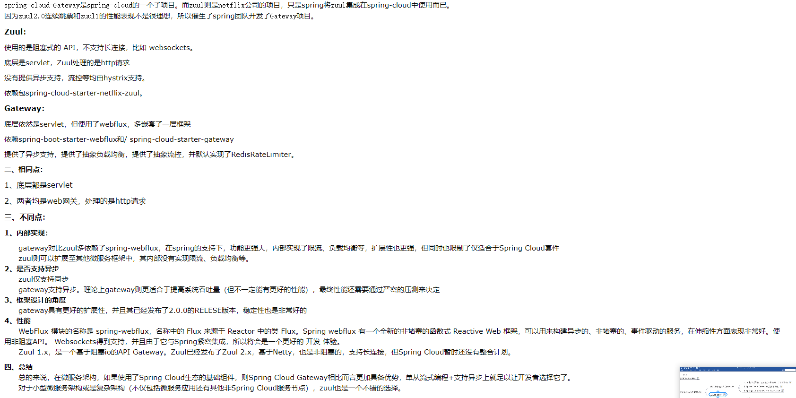

``` markdown
# SpringCloud GateWay 是基于WebFlux框架实现的，WebFlux底层使用的是高兴的Reactor模式通信框架Netty
# 异步非阻塞
```

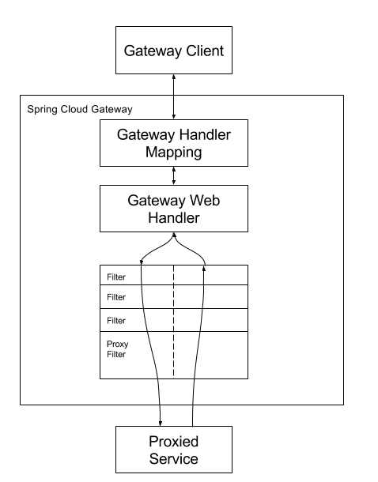	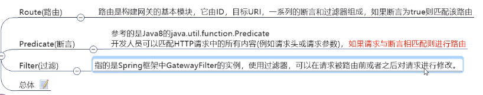

> 
>

# 十一、Config


## 客户端

``` markdown
# application.yml是用户级得资源配置项
# bootstrap.yml是系统级的，优先级更加高
	两个拼起来，互补
```

```yml
server:
  port: 3355
spring:
  application:
    name: config-client
  cloud:
    #Config客户端配置
    config:
      label: master #分支名称
      name: config #配置文件名称
      profile: dev #读取后缀名称   上述3个综合：master分支上config-dev.yml的配置文件被读取http://config-3344.com:3344/master/config-dev.yml
      uri: http://localhost:3344 #配置中心地址k
#服务注册到eureka地址
eureka:
  client:
    service-url:
      defaultZone: http://localhost:7001/eureka
```

```Java
@RestController
@RefreshScope
public class ConfigClientController {
    @Value("${config.info}")
    private String configInfo;

    @GetMapping("/configInfo")
    public String getConfigInfo() {
        return configInfo;
    }
}
```

```Java
@EnableEurekaClient
@SpringBootApplication
public class ConfigClientMain3355 {
    public static void main(String[] args) {
        SpringApplication.run(ConfigClientMain3355.class, args);
    }
}
```

## 动态刷新

``` markdown
# 服务端改动，客户端动态刷新，不用重启微服务
	修改github的配置，服务端重启，客户端重启
```

```xml
<dependency>
    <groupId>org.springframework.boot</groupId>
    <artifactId>spring-boot-starter-actuator</artifactId>
</dependency>
#	监控
```

```yml
# 暴露监控端点
management:
  endpoints:
    web:
      exposure:
        include: "*"
```

```java
@RefreshScope
//主启动类上加上上面的注解
//然后想3355发送一个POST请求刷新3355
//http://localhost:3355/actuator/refresh
```

# 十二、BUS消息总线

	

``` markdown
# SpringCloud BUS和SpringCloud Config配合实现动态刷新
```

	

## SpringCloud Bus动态刷新全局广播

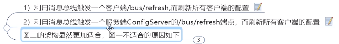	

```xml
<dependency>
    <groupId>org.springframework.cloud</groupId>
    <artifactId>spring-cloud-starter-bus-amqp</artifactId>
</dependency>
<!-- RabbitMq支持 -->
```

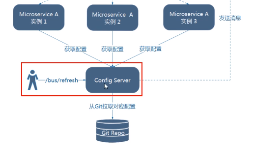	

```yml
server:
  port: 3344

spring:
  application:
    name:  cloud-config-center #注册进Eureka服务器的微服务名
  cloud:
    config:
      server:
        git:
          uri: https://github.com/lijinggen/cloud2020.git #GitHub上面的git仓库名字
        ####搜索目录
          search-paths:
            - springcloud-config
      ####读取分支
      label: master
#rabbitmq相关配置
  rabbitmq:
      host: 172.18.1.52
      port: 5672
      username: guest
      password: guest

#服务注册到eureka地址
eureka:
  client:
    service-url:
      defaultZone: http://localhost:7001/eureka


##rabbitmq相关配置,暴露bus刷新配置的端点
management:
  endpoints: #暴露bus刷新配置的端点
    web:
      exposure:
        include: 'bus-refresh'
```

```Java
@SpringBootApplication
@EnableConfigServer
public class ConfigCenterMain3344
{
    public static void main(String[] args) {
            SpringApplication.run(ConfigCenterMain3344.class, args);
    }
}
```

```yml
server:
  port: 3355

spring:
  application:
    name: config-client
  cloud:
    #Config客户端配置
    config:
      label: master #分支名称
      name: config #配置文件名称
      profile: dev #读取后缀名称   上述3个综合：master分支上config-dev.yml的配置文件被读取http://config-3344.com:3344/master/config-dev.yml
      uri: http://localhost:3344 #配置中心地址k

#  rabbitmq相关配置 15672是Web管理界面的端口；5672是MQ访问的端口
  rabbitmq:
    host: 172.18.1.52
    port: 5672
    username: guest
    password: guest

#服务注册到eureka地址
eureka:
  client:
    service-url:
      defaultZone: http://localhost:7001/eureka
# 暴露监控端点
management:
  endpoints:
    web:
      exposure:
        include: "*"
```

```java
@EnableEurekaClient
@SpringBootApplication
public class ConfigClientMain3355 {
    public static void main(String[] args) {
        SpringApplication.run(ConfigClientMain3355.class, args);
    }
}
```

```yml
server:
  port: 3366

spring:
  application:
    name: config-client
  cloud:
    #Config客户端配置
    config:
      label: master #分支名称
      name: config #配置文件名称
      profile: dev #读取后缀名称   上述3个综合：master分支上config-dev.yml的配置文件被读取http://config-3344.com:3344/master/config-dev.yml
      uri: http://localhost:3344 #配置中心地址

#rabbitmq相关配置 15672是Web管理界面的端口；5672是MQ访问的端口
  rabbitmq:
    host: 172.18.1.52
    port: 5672
    username: guest
    password: guest

#服务注册到eureka地址
eureka:
  client:
    service-url:
      defaultZone: http://localhost:7001/eureka

# 暴露监控端点
management:
  endpoints:
    web:
      exposure:
        include: "*"
```

```Java
@EnableEurekaClient
@SpringBootApplication
public class ConfigClientMain3366
{
    public static void main(String[] args)
    {
        SpringApplication.run(ConfigClientMain3366.class,args);
    }
}
```


	

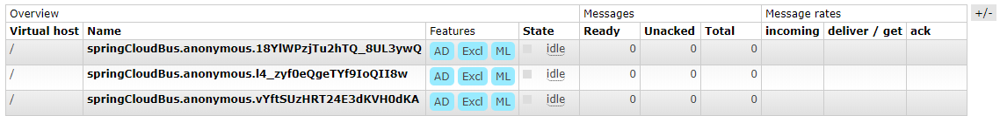

## Bus动态刷新定点通知

	

# 十三、Stream

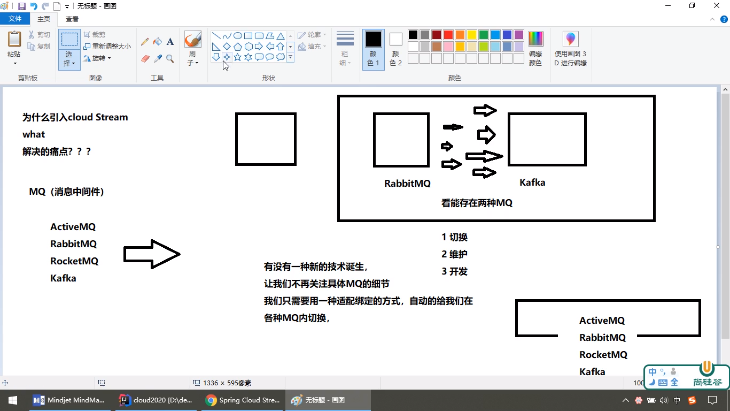	

> CLOUD STREAM可以屏蔽这些差异

	

``` markdown
# 引入之后
> Stream屏蔽中间件的细节
> 通过定义绑定起Binder作为中间层，实现了应用程序与消息中间件细节之间的隔离
```

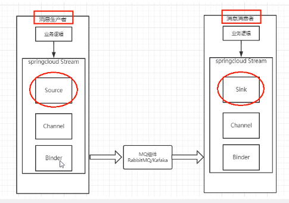	

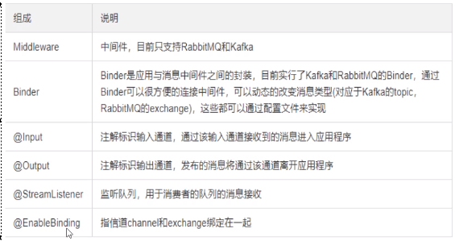	

## 实操

```XML
<dependency>
    <groupId>org.springframework.cloud</groupId>
    <artifactId>spring-cloud-starter-stream-rabbit</artifactId>
</dependency>
```

```yml
server:
  port: 8801

spring:
  application:
    name: cloud-stream-provider
  cloud:
      stream:
        binders: # 在此处配置要绑定的rabbitmq的服务信息；
          defaultRabbit: # 表示定义的名称，用于于binding整合
            type: rabbit # 消息组件类型
            environment: # 设置rabbitmq的相关的环境配置
              spring:
                rabbitmq:
                  host: localhost
                  port: 5672
                  username: guest
                  password: guest
        bindings: # 服务的整合处理
          output: # 这个名字是一个通道的名称
            destination: studyExchange # 表示要使用的Exchange名称定义
            content-type: application/json # 设置消息类型，本次为json，文本则设置“text/plain”
            binder: defaultRabbit # 设置要绑定的消息服务的具体设置

eureka:
  client: # 客户端进行Eureka注册的配置
    service-url:
      defaultZone: http://localhost:7001/eureka
  instance:
    lease-renewal-interval-in-seconds: 2 # 设置心跳的时间间隔（默认是30秒）
    lease-expiration-duration-in-seconds: 5 # 如果现在超过了5秒的间隔（默认是90秒）
    instance-id: send-8801.com  # 在信息列表时显示主机名称
    prefer-ip-address: true     # 访问的路径变为IP地址
```

```Java
public interface IMessageProvider
{
    public String send();
}

@EnableBinding(Source.class) //定义消息的推送管道
public class MessageProviderImpl implements IMessageProvider
{
    @Resource
    private MessageChannel output; // 消息发送管道

    @Override
    public String send()
    {
        String serial = UUID.randomUUID().toString();
        output.send(MessageBuilder.withPayload(serial).build());
        System.out.println("*****serial: "+serial);
        return null;
    }
}
```

## 分组订阅 路由

### 1.分组

```YML
server:
  port: 8802

spring:
  application:
    name: cloud-stream-consumer
  cloud:
      stream:
        binders: # 在此处配置要绑定的rabbitmq的服务信息；
          defaultRabbit: # 表示定义的名称，用于于binding整合
            type: rabbit # 消息组件类型
            environment: # 设置rabbitmq的相关的环境配置
              spring:
                rabbitmq:
                  host: 172.18.1.52
                  port: 5672
                  username: guest
                  password: guest
        bindings: # 服务的整合处理
          input: # 这个名字是一个通道的名称
            destination: studyExchange # 表示要使用的Exchange名称定义
            content-type: application/json # 设置消息类型，本次为对象json，如果是文本则设置“text/plain”
            binder: defaultRabbit # 设置要绑定的消息服务的具体设置
            group: atguigu
  rabbitmq:
    host: 172.18.1.52
    port: 5672
    username: guest
    password: guest


eureka:
  client: # 客户端进行Eureka注册的配置
    service-url:
      defaultZone: http://localhost:7001/eureka
  instance:
    lease-renewal-interval-in-seconds: 2 # 设置心跳的时间间隔（默认是30秒）
    lease-expiration-duration-in-seconds: 5 # 如果现在超过了5秒的间隔（默认是90秒）
    instance-id: receive-8802.com  # 在信息列表时显示主机名称
    prefer-ip-address: true     # 访问的路径变为IP地址
```

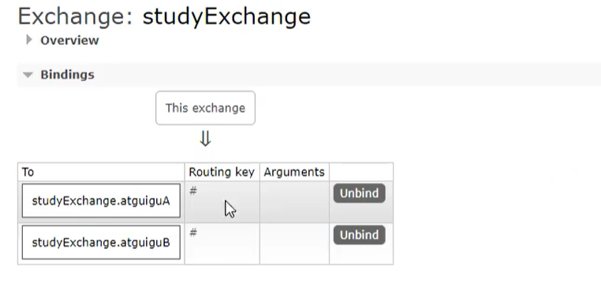	

# 十四、SpringCloud Sleuth

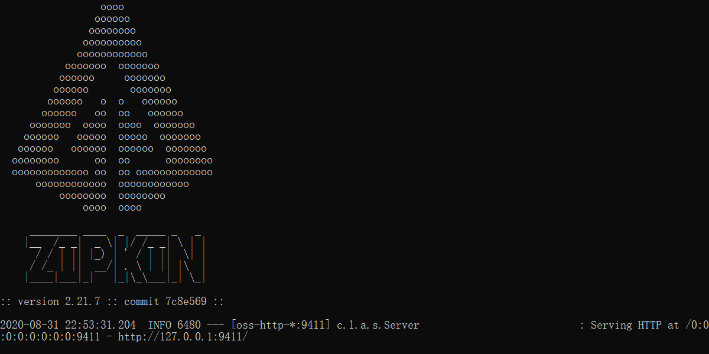

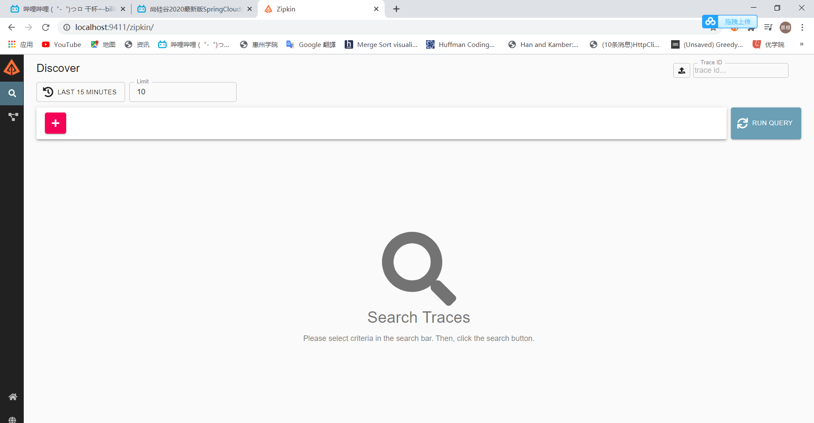

``` markdown
# 原理图
```


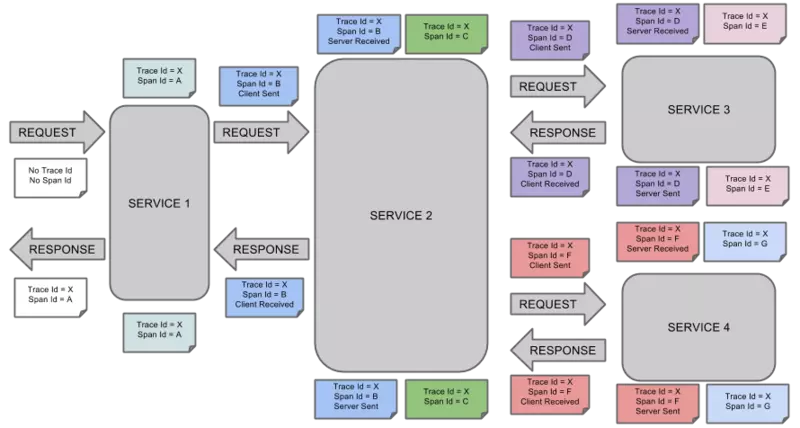


